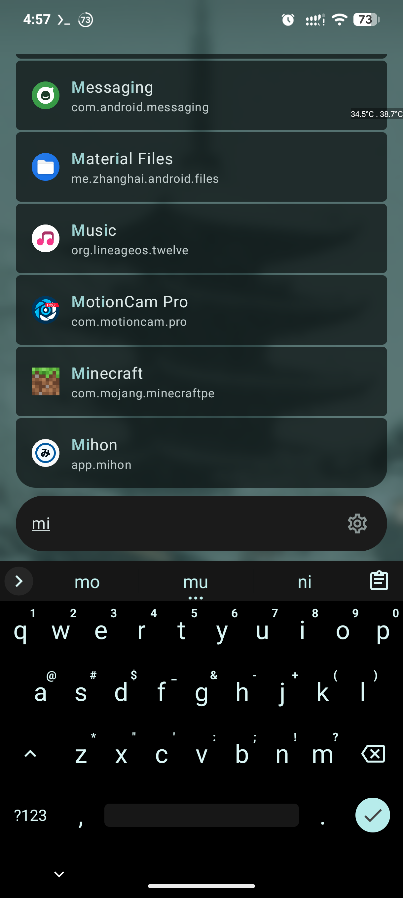
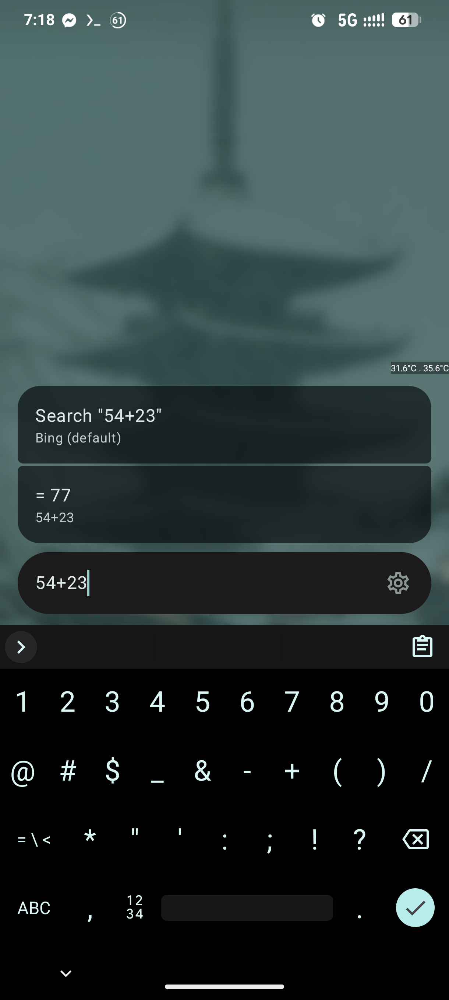
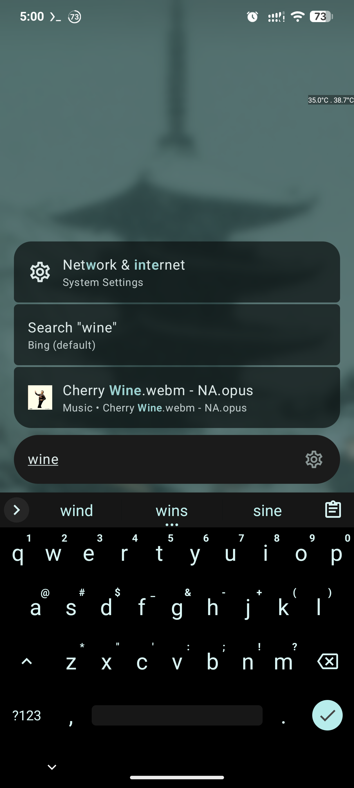

# Search

A keyboard-first Android command palette that unifies app launching, device search, and system utilities into a single, customizable overlay. Set it as your default assistant for instant access from anywhere.

## Providers

- **Apps** — Fuzzy-matched launcher with AI shortcuts (`gemini`, `chatgpt`)
- **Calculator** — Instant math with clipboard copy
- **Contacts** — Search with thumbnails and quick actions
- **Files** — Local search with media thumbnails
- **Settings** — System shortcuts + privileged toggles via Shizuku
- **Termux** — Execute terminal commands from the search bar
- **Text Utils** — Base64, URL encode/decode, redirect cleaning
- **Web Search** — Multi-engine with quicklinks (`g`, `ddg`)

## Features

- **Alias System** — Create custom keywords for apps and searches
- **Smart Ranking** — Learns from usage with competitive decay
- **Material 3 UI** — Adjustable blur, opacity, and motion
- **Power-User Tools** — Deep Termux and Shizuku integration

## Screenshots

  
  

  

## Building

See [BUILDING.md](BUILDING.md) for local and CI build instructions.

## Assist Behavior

For details about assist-session lifecycle behavior, current mitigations, side effects (including possible flicker), and alternative approaches, see [ASSIST_LIFECYCLE.md](ASSIST_LIFECYCLE.md).
